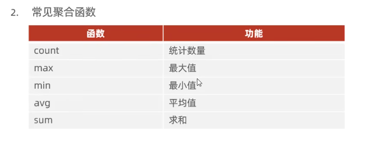
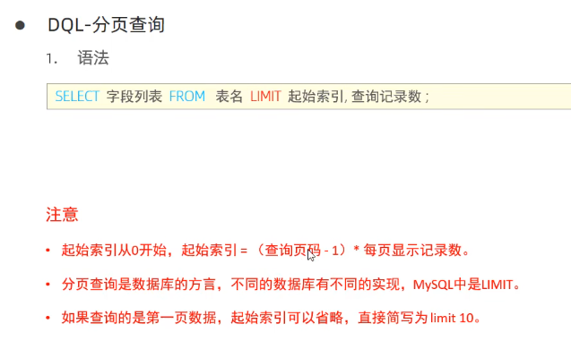
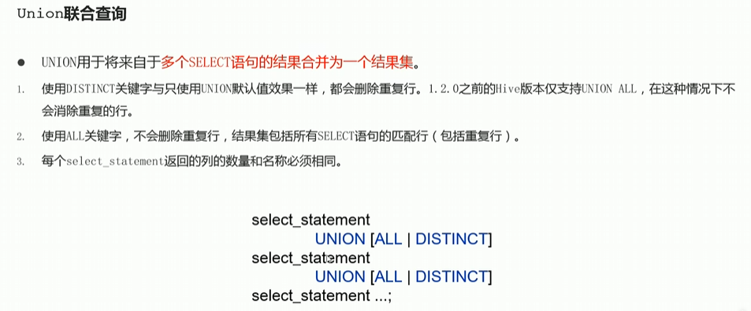
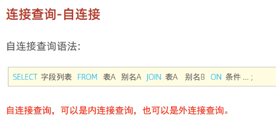
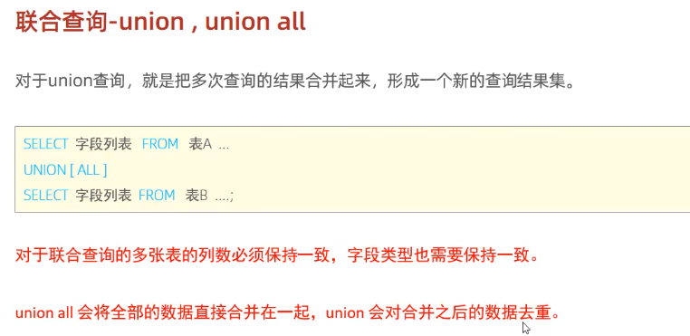
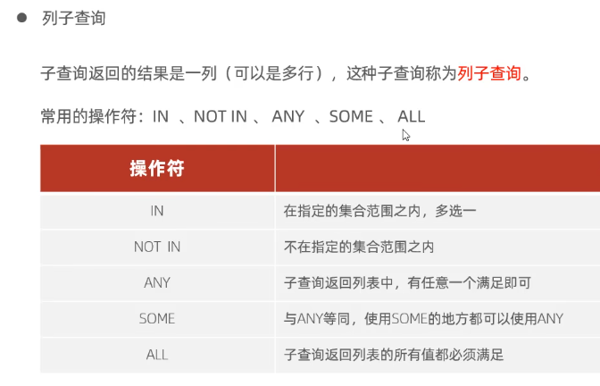

# 基础语法总结




非空 `WHERE 字段名 is NOT NULL` 或 `WHERE NOT 字段名`

> 查询名字长度为2的员工：`SELECT * FROM Employee WHERE name like '_ _';`
>

执行顺序：`from, where, group by, having, **select**, order by, limit`

可以对字段取别名，并调用 `SELECT **e.name** **ename** FROM emp e where **e.age**<20 ORDER BY **ename**;`


# 条件查询 where


非空 `WHERE 字段名 is NOT NULL` 或 `WHERE NOT 字段名`

> 查询名字长度为2的员工：`SELECT * FROM Employee WHERE name like '_ _';`
>


# 聚合函数


聚合函数作用于某一列（或count整张表）。null值不参与聚合函数运算


# 分组查询 group by


注意事项举例

> `select name, gender, count(*) from emp group by gender;`
>
> 查询结果只有gender和count(*)有意义，name在每个分组中有很多，只会显示一个，无意义。
>


# 排序查询 order by


# 分页查询 limit



# UNION查询



# With查询


```sql
-- select语句
with q1 as (select num, name from student where num = 2)
selcect * from q1;

-- from风格
with q1 as (select num, name from student where num = 2)
from q1 select *;

-- 链式调用
with q1 as (select * from student where num = 2),
     q2 as (select num, name from q1)
select * from q2;

-- union
with q1 as (select * from student where num = 2),
     q2 as (select * from student where num = 3)
select * from q1 union all select * from q2;


```

# 


# 多表查询
## 连接查询
### 内连接


**当内连接关联条件为null的时候，该条数据查询不到**

```sql
-- 查询每一个员工的姓名，以及所在部门名称
-- 表结构：emp ，dept
-- 连接条件：emp.dept_id = dept.id

-- 隐式内连接
select emp.name, dept.name from emp, dept where emp.dept_id = dept.id;

-- 显式内连接
select e.name, d.name from emp e INNER JOIN dept d on e.dept_id = d.id;
```

### 外连接


一般常用左外连接，右外可以转为左外

### 自连接


自连接两张表必须**起别名**

```sql
-- 查询员工 及其 所属领导的名字（不包括领导）
-- 连接条件：emp_a.managerid = emp_b.id
select a.name, b.name from emp a, emp b where a.managerid = b.id;

-- 查询员工 及其 所属领导的名字（包括领导）
select a.name, b.name from emp a left join emp b on a.managerid = b.id;

```


### 联合查询


**union**会去重，**union all**不会去重

联合查询要求多个查询的列数保持一致

```sql
-- 将薪资小于5000的员工和年龄大于50的员工查询出来
select * from emp where salary < 5000
union
select * from emp where age > 50;
```

## 子查询


子查询分类依据：**子查询**返回的结果，而不是整个查询语句返回的结果

### 标量子查询


```sql
-- 查询 销售部 的所有员工信息
select * from emp where dept_id = (select id from dept where name = '销售部');
```

### 列子查询


理解操作符：只有子查询会出现多列的情况，where 语句的普通查询条件都是一条，或者用in。

```sql
-- 查询 销售部 和 市场部 所有员工信息
select * from emp where dept_id in (select id from dept 
                                    where name = '销售部' or name = '市场部');

-- 查询比财务部所有人工资都高的员工信息
-- a. 查询所有财务部人员工资
select salary from emp where dept_id = (select id from dept where name = '财务部');
-- b. 查询比财务部所有人工资都高的员工信息
select * from emp where salary > all (select salary from emp where dept_id = 
                                      (select id from dept where name = '财务部'));
```

### 行子查询


```sql
-- 查询与张无忌薪资和直属领导相同的员工信息
-- a.查询张无忌的薪资和直属领导
select salary, managerid from emp where name = '张无忌';

-- b.查询与张无忌薪资和直属领导相同的员工信息
-- where 语句的另一种写法
select * from emp where (salary,managerid) = (12500,1);
select * from emp where (salary,managerid) = (select salary, managerid from emp 
                                              where name = '张无忌');
```

### 表子查询


理解操作符：in 只需要满足一个条件，这里是满足任意一行数据（不能交叉满足）

经常出现在 from 之后

```sql
-- 查询与 鹿杖客 张无忌 职位和薪资相同的员工信息
select * from emp where (job, salary) in (select job,salary from emp
                                          where name = '鹿杖客' or name ='张无忌');

-- 查询 2006 年之后入职的员工信息，及其所在部门信息
-- 两种查询都可以，但是用嵌套查询的效率更高
select * from (select * from emp where entrydate > 2006) e 
left join dept d on e.dept_id = d.id;

select * from emp e left join dept d on e.dept_id = d.id where entrydate>2006;
```

